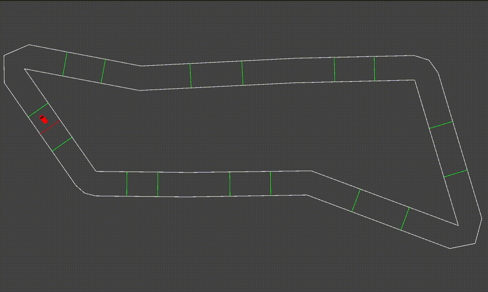
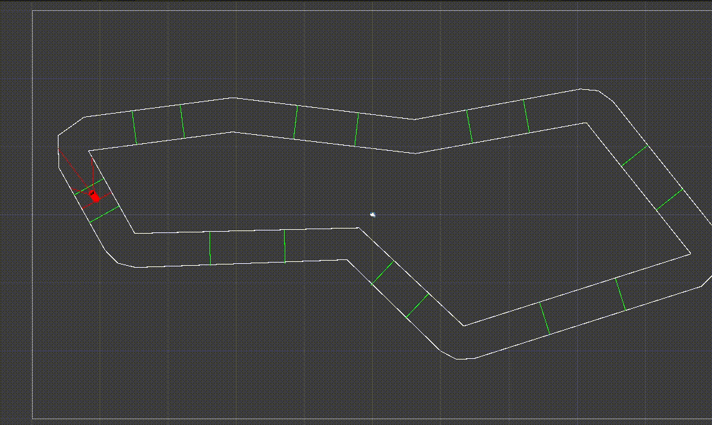

# Machine Learning experiment with Unity

This simulation environment consist of a procedurally generated race track and unmanned vehicles, which try to reach as many checkpoints as possible.

The vehicles have three depth sensors (left, right and front), a steering wheel, an accelerator and a brake. They use a Neural Network to decide which action to take (turn left, turn right, accelerate, break). 

The Neural Network is trained using a Genetic Algorithm. There's no special library used, every component (Genetic Algorithm, Neural Network, Race Track Generator are implemented using plain C#)

## Visualization of trained agent 

## Visualization of depth sensor on trained agent

